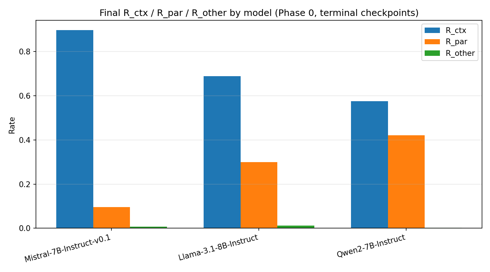
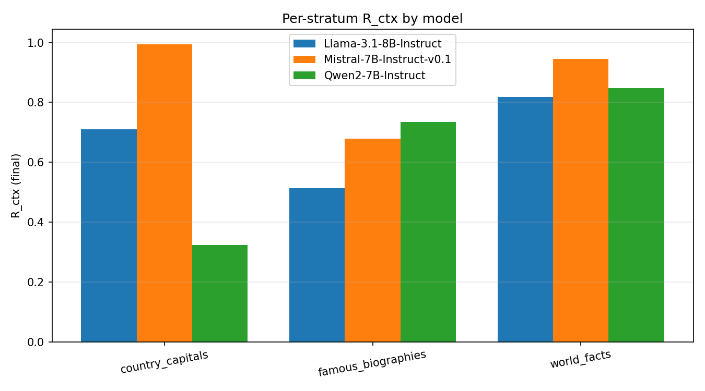
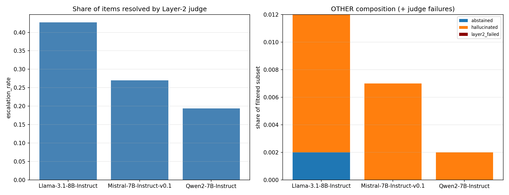
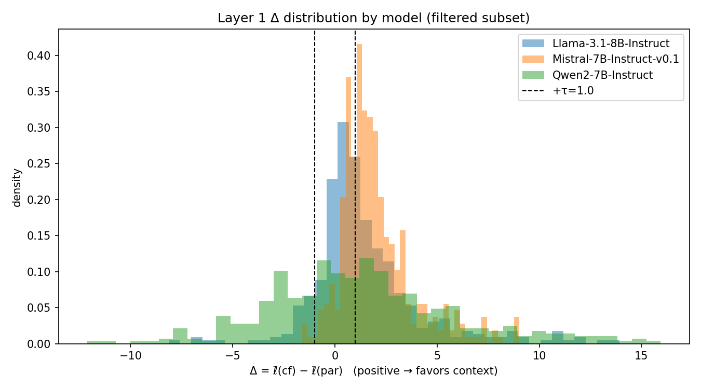

# Phase 0 — Baseline CPI Evaluation Report

_Generated: 2026-07-06T10:31:01.422262+00:00_

## 1. Models evaluated

- **meta-llama/Llama-3.1-8B-Instruct** — n_items=416, τ=1.0, judge=enabled
- **mistralai/Mistral-7B-Instruct-v0.1** — n_items=416, τ=1.0, judge=enabled
- **Qwen/Qwen2-7B-Instruct** — n_items=416, τ=1.0, judge=enabled

## 2. Headline results (final, judge-backstopped)

| model                              |   n_items |   filter_yield |   R_ctx | R_ctx_ci       |   R_par |   R_other |   escalation_rate |   layer2_failed_rate |
|:-----------------------------------|----------:|---------------:|--------:|:---------------|--------:|----------:|------------------:|---------------------:|
| mistralai/Mistral-7B-Instruct-v0.1 |       416 |          0.978 |   0.897 | [0.867, 0.924] |   0.096 |     0.007 |             0.27  |                    0 |
| meta-llama/Llama-3.1-8B-Instruct   |       416 |          0.99  |   0.689 | [0.643, 0.733] |   0.299 |     0.012 |             0.427 |                    0 |
| Qwen/Qwen2-7B-Instruct             |       416 |          0.981 |   0.576 | [0.527, 0.623] |   0.422 |     0.002 |             0.194 |                    0 |

## 3. Per-stratum breakdown

**meta-llama/Llama-3.1-8B-Instruct**

| stratum            |   n_passed |   R_ctx |   filter_yield |   escalation_rate |
|:-------------------|-----------:|--------:|---------------:|------------------:|
| country_capitals   |        187 |   0.711 |          0.979 |             0.561 |
| famous_biographies |        109 |   0.514 |          1     |             0.44  |
| world_facts        |        116 |   0.819 |          1     |             0.198 |

**mistralai/Mistral-7B-Instruct-v0.1**

| stratum            |   n_passed |   R_ctx |   filter_yield |   escalation_rate |
|:-------------------|-----------:|--------:|---------------:|------------------:|
| country_capitals   |        187 |   0.995 |          0.979 |             0.225 |
| famous_biographies |        109 |   0.679 |          1     |             0.413 |
| world_facts        |        111 |   0.946 |          0.957 |             0.207 |

**Qwen/Qwen2-7B-Instruct**

| stratum            |   n_passed |   R_ctx |   filter_yield |   escalation_rate |
|:-------------------|-----------:|--------:|---------------:|------------------:|
| country_capitals   |        188 |   0.324 |          0.984 |             0.197 |
| famous_biographies |        109 |   0.734 |          1     |             0.275 |
| world_facts        |        111 |   0.847 |          0.957 |             0.108 |

## 4. Method agreement diagnostics

| model                    |   ordered_vs_final_agreement |   paper_cf_acc_vs_final_CTX_agreement |
|:-------------------------|-----------------------------:|--------------------------------------:|
| Llama-3.1-8B-Instruct    |                        0.932 |                                 0.937 |
| Mistral-7B-Instruct-v0.1 |                        0.946 |                                 0.951 |
| Qwen2-7B-Instruct        |                        0.931 |                                 0.926 |

## 5. Pairwise model comparison (McNemar)

| model_a                  | model_b                  |   n_common_items |   n01_switched_to_ctx_in_b |   n10_switched_from_ctx_in_b |   p_value |
|:-------------------------|:-------------------------|-----------------:|---------------------------:|-----------------------------:|----------:|
| Llama-3.1-8B-Instruct    | Mistral-7B-Instruct-v0.1 |              406 |                        100 |                           15 |    0      |
| Llama-3.1-8B-Instruct    | Qwen2-7B-Instruct        |              406 |                         56 |                          100 |    0.0005 |
| Mistral-7B-Instruct-v0.1 | Qwen2-7B-Instruct        |              402 |                         17 |                          146 |    0      |

## 6. Charts

## 7. Notes / caveats

- These are terminal-checkpoint (released, post-alignment) readings, not an SFT trajectory — high R_ctx here does not rule out CPI having occurred earlier in training and being reversed by later alignment stages; that requires Arm B (checkpoint trajectory) data.
- `R_ctx`/`R_par`/`R_other` under `final` are guaranteed to partition to 1.0 here because the Layer-2 judge was mandatory for this run (see assertion above) — no `AMBIG` leaked into `final_label`.
- `paper`/`ordered` are diagnostics only and were never used to compute `final`; their agreement with `final` above is a validity check on the measurement, not a second vote.
